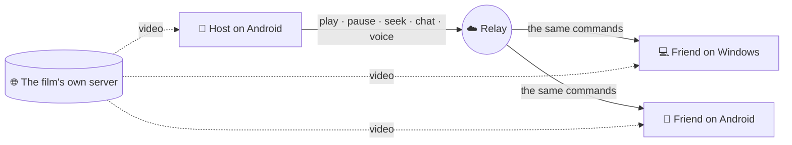
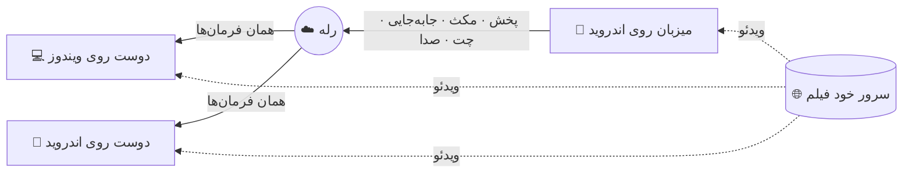
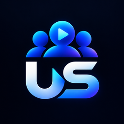

<div align="center">



<br><br>

[](https://github.com/Pytholearn/UsPlayer-Android/releases/latest)
[](https://github.com/Pytholearn/UsPlayer-Android/releases)
[](#-install)
[](LICENSE)


[](https://github.com/Pytholearn/UsPlayer)

<br>

<a href="https://github.com/Pytholearn/UsPlayer-Android/releases/latest"></a>
&nbsp;
<a href="https://github.com/Pytholearn/UsPlayer/releases/latest"></a>

<br><br>

**[English](#english)** &nbsp;·&nbsp; **[فارسی](#persian)**

</div>

---

<a id="english"></a>

## English

**Us Player for Android** puts the watch party in your pocket. One person hosts a room **by name**, everyone else joins with that name, and the film plays for all of you at the same moment — whether they are on a phone or [on a PC](https://github.com/Pytholearn/UsPlayer). No IP addresses, no port forwarding. Talk while you watch, react across the picture, keep the chat on screen.

> Not a port of the desktop app squeezed onto a phone: a native Android app — Kotlin, Jetpack Compose, Media3 — that speaks the **same watch-party protocol**, byte for byte. That compatibility is tested against the real Windows code on every build.

### ✨ Features

<table>
<tr>
<td width="50%" valign="top">

#### 🎬 Watch party
- Host or join **by room name** — the same rooms Windows uses
- **Shared control**: anyone's play, pause or seek reaches everyone
- Optional room **password** that never crosses the wire
- Subtitles the host loads **travel with the room**
- The room keeps running in the background with its notification

</td>
<td width="50%" valign="top">

#### 🎙️ Together
- **Voice chat** that opens as soon as you join — one tap to mute
- Voice from the **loudspeaker** or the **earpiece**, your choice
- Echo cancellation and noise suppression from the phone itself
- **Chat over the picture** and **reactions across the whole screen**
- A talk button that floats over the film, so it never waits for the controls

</td>
</tr>
<tr>
<td valign="top">

#### 📱 Made for a phone
- **Pinch to zoom** the picture, 0.5× to 4×, and pan around it
- **Picture-in-picture** — keep watching over other apps
- Double-tap to skip, swipe to scrub
- Layouts for portrait, landscape and tablets
- Subtitles stay on the picture when you turn the phone

</td>
<td valign="top">

#### 🔗 Smart links
- Paste a **movie page**, not just a direct link — the real video behind it is found for you
- **Search tab**: sites to find a film on, each with a short note
- Open links shared from any other app straight into Us Player
- History, favorites, resume where you left off

</td>
</tr>
<tr>
<td valign="top">

#### 🔊 Audio, video, subtitles
- Volume boost, **10-band equalizer**, compressor, audio delay
- Brightness, contrast, saturation, gamma, hue, sharpen, rotate, mirror
- `.srt` / `.ass` / `.vtt`, Persian **encoding detected automatically**
- Subtitle size, color, outline, position and delay — all live

</td>
<td valign="top">

#### 💙 Made for people
- **Persian and English**, right-to-left done properly
- The same three themes — **Us Blue**, Dark Purple, Dark Mint
- **Updates itself** — every download checked against its SHA-256
- Nothing installs without Android's own confirmation
- **No telemetry**

</td>
</tr>
</table>

### 📥 Install

1. Download **`UsPlayer-<version>.apk`** from the [latest release](https://github.com/Pytholearn/UsPlayer-Android/releases/latest).
2. Open it. Android asks you to allow installing apps from this source — the normal prompt for anything that does not come from a store. Allow it and install.
3. **Play Protect** may say the app was not installed from Google Play. Tap **Install anyway**. You can check the file against the SHA-256 on its release page, and the signing key below.

**Requires Android 8.0 or newer.** Future versions arrive inside the app: it offers the update, downloads it only when you tap, verifies it, and hands it to Android's installer.

### 🍿 Watch together in three steps

| | Host | Friends — on a phone or a PC |
|:-:|---|---|
| **1** | **Party → Host**, type a room name (and a password if you like) | **Party → Join**, type the same name |
| **2** | Tap **Create Room** | Tap **Join** |
| **3** | Open a film by link | It opens for them too, in sync |

### 🧠 How it works

The film **never goes through our server**. Every phone and every PC streams it straight from where it lives; only tiny control messages — play, pause, seek, chat — and voice pass through the relay.



### 🔐 Permissions, and why

| Permission | What it is for |
|---|---|
| 🎙️ Microphone | Voice chat. Asked only when you join voice; everything else works without it. |
| 🔔 Notifications | The playback and room notifications — what lets Android keep a film and a room alive in the background. |
| 📦 Install apps | In-app updates. Nothing installs by itself: you tap, the file is verified, and Android asks you again. |

### 🔒 Privacy & security

- **Room passwords never leave your phone** — a salted challenge and response, only a proof crosses the network.
- **Everything from a room is treated as hostile**: size-capped, validated, replay-protected, rate-limited.
- **A file on your phone is never broadcast** — a path on your phone means nothing on anyone else's.
- **Updates are verified** against the SHA-256 published with them, then confirmed by you in Android's installer.
- **Every release is signed with the same key.** Android refuses any "update" that is not, so nobody else can hand you one. The certificate's SHA-256 fingerprint:

```
12:CE:4D:C4:82:92:0C:74:C0:B7:24:74:E7:22:16:9E:DD:CB:B2:80:84:23:E7:1B:13:55:0B:CC:81:A2:5B:1D
```

### ❓ FAQ

<details>
<summary><b>Can I join a room someone hosts on Windows?</b></summary>
<br>
Yes — and they can join yours. Both builds speak the same protocol, and that is checked against the real Windows code on every Android build.
</details>

<details>
<summary><b>Why is it not on Google Play?</b></summary>
<br>
Us Player updates itself from this repository, which Play does not allow. The APK on the releases page is the official build, signed with the key above.
</details>

<details>
<summary><b>Friends hear an echo of their own voice.</b></summary>
<br>
The microphone is hearing your loudspeaker. Wear headphones, tap the mic to mute when you are not talking, or turn off <b>Settings → Voice → Play voice through the loudspeaker</b> — the earpiece route is where the phone's echo canceller works best.
</details>

<details>
<summary><b>The room drops when I switch to another app.</b></summary>
<br>
Some phones' battery savers stop apps in the background. Give Us Player <b>unrestricted</b> battery use in Android settings, and allow its notifications — they are how Android knows the app is busy.
</details>

<details>
<summary><b>My Persian subtitle shows broken letters.</b></summary>
<br>
The encoding is detected automatically, and Windows-1256 is tried for Persian files. If a file still looks wrong, pick it by hand under <b>Subtitles → Text encoding</b>.
</details>

---

<a id="persian"></a>

<div dir="rtl">

## فارسی

**Us Player اندروید** تماشای گروهی را به جیبت می‌آورد. یک نفر با یک **اسم** اتاق می‌سازد، بقیه با همان اسم وارد می‌شوند، و فیلم برای همه در یک لحظه پخش می‌شود — چه روی گوشی باشند چه [روی کامپیوتر](https://github.com/Pytholearn/UsPlayer). بدون IP، بدون پورت‌فورواردینگ. موقع تماشا با هم حرف بزنید، روی تصویر واکنش بفرستید، چت را روی صفحه داشته باشید.

> این نسخهٔ دسکتاپ نیست که به‌زور در گوشی جا شده باشد: یک برنامهٔ واقعی اندروید است — Kotlin، Jetpack Compose و Media3 — که **همان پروتکل تماشای گروهی** را بایت‌به‌بایت حرف می‌زند. این سازگاری در هر بیلد با کد واقعی ویندوز آزمایش می‌شود.

### ✨ امکانات

<table dir="rtl">
<tr>
<td width="50%" valign="top">

#### 🎬 تماشای گروهی
- ساختن و پیوستن **با اسم اتاق** — همان اتاق‌های ویندوز
- **کنترل مشترک**: پخش، مکث یا جابه‌جایی هر کسی به همه می‌رسد
- **رمز** اختیاری برای اتاق که هیچ‌وقت روی شبکه نمی‌رود
- زیرنویسی که میزبان باز می‌کند **برای همه ارسال می‌شود**
- اتاق با اعلانش در پس‌زمینه زنده می‌ماند

</td>
<td width="50%" valign="top">

#### 🎙️ با هم
- **چت صوتی** که به‌محض ورود باز می‌شود — یک لمس برای بی‌صدا کردن
- پخش صدا از **بلندگو** یا **گوشی تماس**، به انتخاب خودت
- حذف اکو و حذف نویز خود گوشی
- **چت روی تصویر** و **واکنش‌ها روی کل صفحه**
- دکمهٔ صحبت شناور روی فیلم، که منتظر کنترل‌ها نمی‌ماند

</td>
</tr>
<tr>
<td valign="top">

#### 📱 ساخته‌شده برای گوشی
- **بزرگ و کوچک کردن تصویر با دو انگشت**، ۰٫۵ تا ۴ برابر، و جابه‌جا کردنش
- **تصویر در تصویر** — تماشا روی برنامه‌های دیگر
- دو ضربه برای جلو و عقب، کشیدن برای جابه‌جایی
- چیدمان برای حالت عمودی، افقی و تبلت
- وقتی گوشی را می‌چرخانی زیرنویس روی تصویر می‌ماند

</td>
<td valign="top">

#### 🔗 لینک هوشمند
- **لینک صفحهٔ فیلم** را بچسبان، نه فقط لینک مستقیم — ویدئوی واقعی پشتش برایت پیدا می‌شود
- **تب جستجو**: سایت‌هایی برای پیدا کردن فیلم، هر کدام با یک توضیح کوتاه
- لینکی که از هر برنامهٔ دیگری به اشتراک بگذاری مستقیم در Us Player باز می‌شود
- تاریخچه، علاقه‌مندی‌ها، ادامه از همان‌جا

</td>
</tr>
<tr>
<td valign="top">

#### 🔊 صدا، تصویر، زیرنویس
- تقویت صدا، **اکولایزر ۱۰ باند**، کمپرسور، تأخیر صدا
- روشنایی، کنتراست، اشباع، گاما، رنگ، شارپ، چرخش، آینه
- `.srt` / `.ass` / `.vtt`، و **تشخیص خودکار انکودینگ** فارسی
- اندازه، رنگ، حاشیه، جایگاه و تأخیر زیرنویس — همه زنده

</td>
<td valign="top">

#### 💙 برای آدم‌ها ساخته شده
- **فارسی و انگلیسی**، با راست‌به‌چپ درست و حسابی
- همان سه تم — **Us Blue**، بنفش تیره، نعنایی تیره
- **خودش را آپدیت می‌کند** — هر دانلود با SHA-256 خودش بررسی می‌شود
- هیچ چیز بدون تأیید خود اندروید نصب نمی‌شود
- **بدون هیچ ردیابی**

</td>
</tr>
</table>

### 📥 نصب

1. فایل **`UsPlayer-<نسخه>.apk`** را از [آخرین ریلیز](https://github.com/Pytholearn/UsPlayer-Android/releases/latest) دانلود کن.
2. بازش کن. اندروید اجازهٔ نصب از این منبع را می‌خواهد — برای هر برنامه‌ای که از فروشگاه نیامده طبیعی است. اجازه بده و نصب کن.
3. ممکن است **Play Protect** بگوید برنامه از گوگل پلی نیامده. **Install anyway** را بزن. می‌توانی فایل را با SHA-256 صفحهٔ ریلیز و کلید امضای پایین مقایسه کنی.

**حداقل اندروید ۸.** نسخه‌های بعدی داخل خود برنامه می‌رسند: آپدیت را پیشنهاد می‌دهد، فقط با زدن تو دانلودش می‌کند، بررسی‌اش می‌کند و به نصب‌کنندهٔ اندروید می‌سپارد.

### 🍿 تماشای گروهی در سه قدم

| | میزبان | دوستان — روی گوشی یا کامپیوتر |
|:-:|---|---|
| **۱** | **اتاق ← ساخت اتاق**، یک اسم اتاق (و اگر خواستی رمز) | **اتاق ← پیوستن**، همان اسم |
| **۲** | **ساخت اتاق** را بزن | **پیوستن** را بزن |
| **۳** | یک فیلم را با لینک باز کن | برای آن‌ها هم باز می‌شود، هماهنگ |

### 🧠 چطور کار می‌کند

فیلم **هیچ‌وقت از سرور ما رد نمی‌شود**. هر گوشی و هر کامپیوتر فیلم را مستقیم از جای خودش پخش می‌کند؛ فقط پیام‌های کوچک کنترلی — پخش، مکث، جابه‌جایی، چت — و صدای گفتگو از رله می‌گذرند.



### 🔐 دسترسی‌ها و دلیلشان

| دسترسی | برای چه |
|---|---|
| 🎙️ میکروفون | چت صوتی. فقط وقتی به صدا می‌پیوندی پرسیده می‌شود؛ بقیهٔ برنامه بدون آن کار می‌کند. |
| 🔔 اعلان‌ها | اعلان پخش و اتاق — همان چیزی که به اندروید اجازه می‌دهد فیلم و اتاق در پس‌زمینه زنده بمانند. |
| 📦 نصب برنامه | آپدیت داخل برنامه. هیچ چیز خودبه‌خود نصب نمی‌شود: تو می‌زنی، فایل بررسی می‌شود، و اندروید دوباره از تو می‌پرسد. |

### 🔒 حریم خصوصی و امنیت

- **رمز اتاق هیچ‌وقت از گوشی‌ات بیرون نمی‌رود** — چالش و پاسخ نمک‌دار، فقط یک اثبات روی شبکه می‌رود.
- **هر چه از اتاق برسد نامطمئن فرض می‌شود**: اندازه محدود، بررسی‌شده، محافظت‌شده در برابر تکرار و سیل پیام.
- **فایل روی گوشی‌ات هیچ‌وقت پخش نمی‌شود** — مسیری روی گوشی تو روی گوشی دیگران معنایی ندارد.
- **آپدیت‌ها بررسی می‌شوند** با SHA-256 منتشرشده‌شان، و بعد تو در نصب‌کنندهٔ اندروید تأییدشان می‌کنی.
- **همهٔ نسخه‌ها با یک کلید امضا می‌شوند.** اندروید هر «آپدیتی» که با همین کلید امضا نشده باشد رد می‌کند، پس کس دیگری نمی‌تواند به تو آپدیت بدهد. اثر انگشت SHA-256 گواهی بالای همین صفحه آمده.

### ❓ سؤال‌های رایج

<details>
<summary><b>می‌توانم وارد اتاقی شوم که کسی روی ویندوز ساخته؟</b></summary>
<br>
بله — و او هم می‌تواند وارد اتاق تو شود. هر دو نسخه یک پروتکل را حرف می‌زنند و این در هر بیلد اندروید با کد واقعی ویندوز بررسی می‌شود.
</details>

<details>
<summary><b>چرا در گوگل پلی نیست؟</b></summary>
<br>
Us Player خودش را از همین ریپو آپدیت می‌کند، که گوگل پلی اجازه نمی‌دهد. APK صفحهٔ ریلیزها نسخهٔ رسمی است و با همان کلید امضا شده.
</details>

<details>
<summary><b>دوستانم صدای خودشان را اکو می‌شنوند.</b></summary>
<br>
میکروفون صدای بلندگوی تو را می‌شنود. هدفون بزن، وقتی حرف نمی‌زنی میکروفون را بی‌صدا کن، یا <b>تنظیمات ← صدای گفتگو ← پخش صدا از بلندگوی اصلی</b> را خاموش کن — روی گوشی تماس، حذف اکوی گوشی بهترین کارش را می‌کند.
</details>

<details>
<summary><b>وقتی به برنامهٔ دیگری می‌روم اتاق قطع می‌شود.</b></summary>
<br>
صرفه‌جوی باتری بعضی گوشی‌ها برنامه‌ها را در پس‌زمینه می‌بندد. در تنظیمات اندروید مصرف باتری Us Player را <b>بدون محدودیت</b> کن و اعلان‌هایش را مجاز بگذار — اندروید از همین‌ها می‌فهمد برنامه مشغول است.
</details>

<details>
<summary><b>زیرنویس فارسی‌ام حروف به‌هم‌ریخته نشان می‌دهد.</b></summary>
<br>
انکودینگ خودکار تشخیص داده می‌شود و برای فایل‌های فارسی Windows-1256 امتحان می‌شود. اگر فایلی باز هم درست نبود، از <b>زیرنویس ← رمزگذاری متن</b> دستی انتخابش کن.
</details>

</div>

---

<div align="center">



**Us Player** · Created by **Hazard** · [usplayer.ir](https://usplayer.ir)

[Android](https://github.com/Pytholearn/UsPlayer-Android) · [Windows](https://github.com/Pytholearn/UsPlayer) · [MIT License](LICENSE)

<sub>If Us Player made a movie night better, a ⭐ helps other people find it.<br>اگر Us Player یک شب فیلم را بهتر کرد، یک ⭐ کمک می‌کند بقیه هم پیدایش کنند.</sub>

</div>
