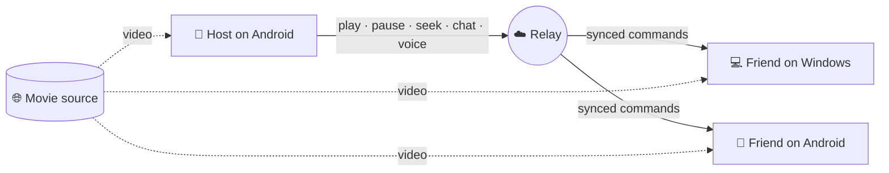

<div align="center">


<br>

**Watch the same movie at the same time — with friends, from your phone.**

<br>

<p align="center">
<a href="https://github.com/Pytholearn/UsPlayer-Android/releases/latest"></a><!--
--><a href="https://github.com/Pytholearn/UsPlayer-Android/releases"></a><!--
--><a href="#install"></a><!--
--><a href="LICENSE"></a>
</p>

<p align="center">

</p>

<p align="center">


</p>

<br>

| | |
| :--: | :--: |
| **Android** | **Windows** |
| [](https://github.com/Pytholearn/UsPlayer-Android/releases/latest) | [](https://github.com/Pytholearn/UsPlayer/releases/latest) |
| <sub><code>UsPlayer-&lt;version&gt;.apk</code> · Android 8.0+</sub> | <sub>Same rooms, same account — chat, reactions &amp; voice</sub> |
| <sub><a href="#install">Install guide</a> · SHA-256 on releases</sub> | <sub><a href="https://github.com/Pytholearn/UsPlayer">UsPlayer</a></sub> |

<br>

**Read in your language** (English is the default)

<p align="center">
<a href="README.md"></a><!--
--><a href="docs/README.zh-CN.md"></a><!--
--><a href="docs/README.fa.md"></a><!--
--><a href="docs/README.ru.md"></a>
</p>

</div>

---

**Us Player for Android** puts the watch party in your pocket. Host a room, send your friends the invite, and everyone stays in sync — on phones or [on PCs](https://github.com/Pytholearn/UsPlayer), with no IP addresses, port forwarding, or router tweaks. When someone pauses, the room pauses. Find a film right inside the app, talk over voice, chat over the video, react with ❤️, and keep your eyes on the movie.

> **Android + Windows:** One account and the same rooms on both. This is a native Android app — Kotlin, Jetpack Compose, Media3 — that speaks the [Windows player](https://github.com/Pytholearn/UsPlayer)'s watch-party protocol byte for byte, tested against the real Windows code on every build.

**On this page:** [Features](#features) · [Install](#install) · [Watch together](#watch-together) · [How it works](#how-it-works) · [Permissions](#permissions) · [Privacy](#privacy) · [FAQ](#faq) · [License](#license)

<a id="features"></a>

<div align="center">

## ✨ **Features**

**Watch together** · **Find a film** · **Made for a phone** · **Private by design**

<br>

| **Together** | **Player** | **Quality of life** |
| :--: | :--: | :--: |
| Synced rooms | Find a film | One account, any device |
| Voice & chat | Picture-in-picture | No tracking |
| Room admin | Subtitles & pinch zoom | Auto-updates |

</div>

<br>

<table width="100%">
<thead>
<tr>
<th align="left" width="50%"><strong>🎬 Watch party</strong></th>
<th align="left" width="50%"><strong>🎙️ Stay connected</strong></th>
</tr>
</thead>
<tbody>
<tr>
<td valign="top">

<ul>
<li><strong>Join with an invite</strong> — Host in one tap and share the invite; no IPs or port forwarding.</li>
<li><strong>Shared playback</strong> — Play, pause, seek, and speed stay in sync for everyone.</li>
<li><strong>±100 ms sync</strong> — Clock alignment and gentle rate correction; seek when needed.</li>
<li><strong>Room password</strong> — Optional; verified locally, never sent in plain text.</li>
<li><strong>The room’s admin</strong> — The host picks the film or lets a friend do it, and can kick, ban, or mute someone for everyone.</li>
<li><strong>Rooms survive the host</strong> — If the admin leaves or their internet drops, the room passes to the next person who joined — a phone can carry it on too.</li>
<li><strong>Shared subtitles</strong> — What the host opens is sent to the room, including late joiners.</li>
</ul>

</td>
<td valign="top">

<ul>
<li><strong>Voice chat</strong> — The mic opens when you join voice; one tap mutes. Echo cancellation and noise suppression come from the phone itself.</li>
<li><strong>Speaker or earpiece</strong> — Play voice through the loudspeaker on the sofa, or the earpiece for no echo.</li>
<li><strong>Mute for me</strong> — Silence anyone just for yourself.</li>
<li><strong>On-screen chat</strong> — Messages fade in along the bottom of the video.</li>
<li><strong>Live reactions</strong> — 👍 ❤️ 😂 😮 🔥 👏 across the screen.</li>
<li><strong>Room roster</strong> — Who’s here, ping, and who’s speaking.</li>
<li><strong>Tidy rooms</strong> — A room with no film, chat, or voice for 10 minutes closes itself.</li>
</ul>

</td>
</tr>
</tbody>
</table>

<br>

<table width="100%">
<thead>
<tr>
<th align="left" width="50%"><strong>🔎 Find a film</strong></th>
<th align="left" width="50%"><strong>📱 Made for a phone</strong></th>
</tr>
</thead>
<tbody>
<tr>
<td valign="top">

<ul>
<li><strong>Search by name</strong> — Films and series with poster, rating, seasons, and comments; press <strong>Play</strong>, nothing to download.</li>
<li><strong>Page URLs</strong> — Paste a movie page; Us Player finds <code>.mp4</code>, <code>.mkv</code>, or <code>.m3u8</code> and shows each step.</li>
<li><strong>Best stream</strong> — Picks the main movie at the highest quality; skips trailers and clutter.</li>
<li><strong>Share to Us Player</strong> — Links shared from any other app open straight in the player.</li>
<li><strong>Your library</strong> — Resume, history, playlist, and favorites.</li>
</ul>

</td>
<td valign="top">

<ul>
<li><strong>Pinch to zoom</strong> — 0.5× to 4×, and pan around the picture.</li>
<li><strong>Picture-in-picture</strong> — Keep watching over other apps.</li>
<li><strong>Gestures</strong> — Double-tap to skip, swipe to scrub.</li>
<li><strong>Keeps running</strong> — The film and the room stay alive in the background with their notification.</li>
<li><strong>Layouts</strong> — Portrait, landscape, and tablets; subtitles stay on the picture when you turn the phone.</li>
</ul>

</td>
</tr>
</tbody>
</table>

<br>

<table width="100%">
<thead>
<tr>
<th align="left" width="50%"><strong>🔊 Audio, video & subtitles</strong></th>
<th align="left" width="50%"><strong>💙 Built with care</strong></th>
</tr>
</thead>
<tbody>
<tr>
<td valign="top">

<ul>
<li><strong>Loud & clear</strong> — Volume up to <strong>300%</strong> with an optional compressor and audio delay.</li>
<li><strong>10-band EQ</strong> — Presets and normalization.</li>
<li><strong>Picture controls</strong> — Brightness, contrast, saturation, gamma, hue, sharpen, rotate, mirror — live.</li>
<li><strong>Subtitles</strong> — <code>.srt</code>, <code>.ass</code>, <code>.vtt</code>; size, color, outline, position, and delay change live; Persian <strong>encoding</strong> detected automatically.</li>
</ul>

</td>
<td valign="top">

<ul>
<li><strong>One account</strong> — Sign in with the same account as on Windows; a new one is confirmed with a 6-digit email code. Rooms know you by it, wherever you join from.</li>
<li><strong>Two languages</strong> — English and Persian, with proper right-to-left layout.</li>
<li><strong>Themes</strong> — Us Blue, Dark Purple, and Dark Mint.</li>
<li><strong>Safe updates</strong> — In-app updates with <strong>SHA-256</strong> verification, installed only after Android asks you.</li>
<li><strong>One signing key</strong> — Every release is signed with the same key, so nobody else can hand you an “update”.</li>
</ul>

</td>
</tr>
</tbody>
</table>

<a id="install"></a>

### 📥 Install

1. Download **`UsPlayer-<version>.apk`** from the [latest release](https://github.com/Pytholearn/UsPlayer-Android/releases/latest).
2. Open it. Android asks you to allow installing apps from this source — the normal prompt for anything that does not come from a store. Allow it and install.
3. If **Play Protect** says the app was not installed from Google Play, tap **Install anyway**. Every release lists its **SHA-256**, and the signing key’s fingerprint is [below](#privacy).
4. On first launch, **sign in** — or create an account and confirm your email with the 6-digit code. The same account works on Windows.

**Requires Android 8.0 or newer.** **Already installed?** The app updates itself; accept the update when it asks.

<a id="watch-together"></a>

### 🍿 Start a watch party in three steps

| Step | Host | Friends — on a phone or a PC |
|:-:|---|---|
| **1** | Open **Party → Host**, add a room name and password if you like, tap **Create Room** | Open **Party → Join** |
| **2** | Tap **Copy invite** and send it | Paste the invite and join |
| **3** | Pick a film with **Search**, a link, or a share from another app | The same film opens for everyone, in sync |

<a id="how-it-works"></a>

### 🧠 How it works

Your movie **never passes through our servers**. Each person streams video **directly from the source**. Only small control messages — play, pause, seek, chat — plus voice audio go through the relay.


```mermaid
flowchart LR
    H["📱 Host on Android"] -->|"play · pause · seek · chat · voice"| R(("☁️ Relay"))
    R -->|"synced commands"| F1["💻 Friend on Windows"]
    R -->|"synced commands"| F2["📱 Friend on Android"]
    S[("🌐 Movie source")]
    S -.->|"video"| H
    S -.->|"video"| F1
    S -.->|"video"| F2
```

<a id="permissions"></a>

### 🔐 Permissions, and why

| Permission | What it is for |
|---|---|
| 🎙️ Microphone | Voice chat. Asked only when you join voice; everything else works without it. |
| 🔔 Notifications | The playback and room notifications — what lets Android keep a film and a room alive in the background. |
| 📦 Install apps | In-app updates. Nothing installs by itself: you tap, the file is verified, and Android asks you again. |

<a id="privacy"></a>

### 🔒 Privacy & security

- **Room passwords stay on your phone.** Join uses a salted challenge–response; only a proof is sent over the network.
- **Your account password goes only to our server**, over TLS to a pinned certificate — checked before a single byte is sent. The session stays on your phone and is never backed up.
- **The room’s secrets stay with the admin.** Friends only get what they need to carry the room on if the admin leaves.
- **Untrusted-by-default messaging.** Room traffic is size-limited, validated, protected against replay, and rate-limited.
- **Local files are not shared.** A file on your phone does not exist on a friend’s device, so the room pauses and asks for a **link everyone can use**.
- **Verified updates.** Downloads that don’t match the published **SHA-256** are rejected.
- **No tracking.** We don’t collect what you watch. The only thing the app reports is an anonymous count when an ad is shown.
- **Every release is signed with the same key.** The certificate’s SHA-256 fingerprint:

```
12:CE:4D:C4:82:92:0C:74:C0:B7:24:74:E7:22:16:9E:DD:CB:B2:80:84:23:E7:1B:13:55:0B:CC:81:A2:5B:1D
```

<a id="faq"></a>

### ❓ FAQ

<details>
<summary><b>Do friends need the same Wi‑Fi or an open port?</b></summary>
<br>
No. The host gets an invite from the relay, so anyone can join from anywhere with just that invite.
</details>

<details>
<summary><b>Can I join a room someone hosts on Windows?</b></summary>
<br>
Yes — and they can join yours, with chat, reactions, and voice. Both apps speak the same protocol, and that is checked against the real <a href="https://github.com/Pytholearn/UsPlayer">Windows</a> code on every Android build.
</details>

<details>
<summary><b>Why do I need an account?</b></summary>
<br>
So a room knows who you are, not just which phone you are on: what the admin allowed you — or a ban — follows you to any device. Use the same account on your phone and your PC. Forgot the password? <b>Forgot password?</b> on the sign-in screen sends a code to your email.
</details>

<details>
<summary><b>What happens if the host leaves or loses internet?</b></summary>
<br>
The room keeps going. It passes to the next person who joined, who becomes the new admin — on a phone or a PC. If the old host comes back, they rejoin as a member.
</details>

<details>
<summary><b>Sign-in, search, or a room won’t connect with my VPN on.</b></summary>
<br>
Our server is in Iran, and some VPNs cannot reach it. Exclude Us Player in your VPN app (split tunnelling / per-app mode) or turn the VPN off. Some Iranian movie sites also block overseas IPs, so a film from one of them may play only with the VPN off.
</details>

<details>
<summary><b>Why is it not on Google Play?</b></summary>
<br>
Us Player updates itself from this repository, which Play does not allow. The APK on the releases page is the official build, signed with the key above.
</details>

<details>
<summary><b>Friends hear an echo of their own voice.</b></summary>
<br>
The microphone is hearing your loudspeaker. Wear headphones, mute the mic when you are not talking, or turn off <b>Settings → Voice → Play voice through the loudspeaker</b> — the phone’s echo canceller works best on the earpiece.
</details>

<details>
<summary><b>The room drops when I switch to another app.</b></summary>
<br>
Some phones’ battery savers stop apps in the background. Give Us Player <b>unrestricted</b> battery use in Android settings, and allow its notifications — they are how Android knows the app is busy.
</details>

<details>
<summary><b>Persian subtitles show <code>???</code> or garbled text.</b></summary>
<br>
The encoding is detected automatically, with Windows-1256 tried for Persian files. If a file still looks wrong, pick <b>Windows-1256</b> under <b>Subtitles → Text encoding</b>.
</details>

<details>
<summary><b>A website says the movie can’t be played.</b></summary>
<br>
DRM-protected services (Filimo, Namava, Gapfilm, and similar) only play inside their official apps; Us Player will tell you clearly instead of failing silently.
</details>

<a id="license"></a>

### 📄 License

Us Player is open source under the **[MIT License](LICENSE)**.

| | |
|---|---|
| **Copyright** | © 2026 [Pytholearn](https://github.com/Pytholearn) |
| **You can** | Use commercially, modify, distribute, and use privately |
| **Please** | Keep the copyright and license notice in copies |
| **Note** | Software is provided *as is*, without warranty |

See the full license text in [LICENSE](LICENSE).

---

<div align="center">


**Us Player** · Created by **Hazard** · [usplayer.ir](https://usplayer.ir)

[Android](https://github.com/Pytholearn/UsPlayer-Android) · [Windows](https://github.com/Pytholearn/UsPlayer) · [MIT License](LICENSE)

[English](README.md) · [中文](docs/README.zh-CN.md) · [فارسی](docs/README.fa.md) · [Русский](docs/README.ru.md)

<br>

<sub>Enjoying Us Player? A ⭐ on GitHub helps more movie fans discover it.</sub>

</div>
