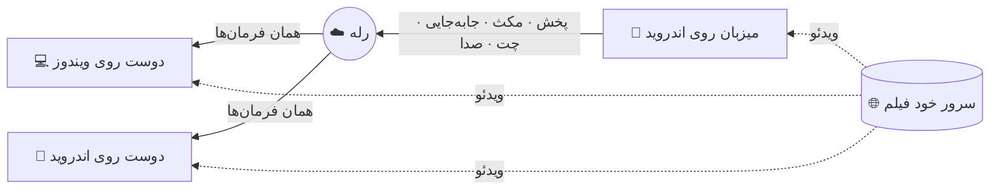

<div align="center">


<br><br>

### زبان · Read in your language

<p>
  <a href="../README.md"></a>
  <a href="README.zh-CN.md"></a>
  <a href="README.fa.md"></a>
  <a href="README.ru.md"></a>
</p>

<p>
  <a href="https://github.com/Pytholearn/UsPlayer-Android/releases/latest"></a>
  <a href="https://github.com/Pytholearn/UsPlayer/releases/latest"></a>
</p>

</div>

---

<div dir="rtl">

## فارسی

**Us Player اندروید** تماشای گروهی را به جیبت می‌آورد. یک اتاق بساز، دعوت‌نامه را برای دوستانت بفرست و همه هماهنگ با هم ببینید — روی گوشی یا [روی کامپیوتر](https://github.com/Pytholearn/UsPlayer)، بدون IP، بدون پورت‌فورواردینگ، بدون دست زدن به مودم. یکی مکث بزند، کل اتاق مکث می‌کند. فیلم را داخل خود برنامه پیدا کن، روی فیلم با هم حرف بزنید، یک ❤️ روی صفحه بفرستید و چت را بخوانید بی‌آنکه چشم از فیلم بردارید.

> گوشی و کامپیوتر با **یک حساب** در یک اتاق کنار هم‌اند: این یک برنامهٔ واقعی اندروید است — Kotlin، Jetpack Compose و Media3 — که پروتکل [نسخهٔ ویندوز](https://github.com/Pytholearn/UsPlayer) را بایت‌به‌بایت حرف می‌زند و در هر بیلد با کد واقعی ویندوز آزمایش می‌شود.

**در این صفحه:** [امکانات](#features) · [نصب](#install) · [تماشای گروهی](#watch-together) · [نحوهٔ کار](#how-it-works) · [دسترسی‌ها](#permissions) · [حریم خصوصی](#privacy) · [سؤالات](#faq) · [مجوز](#license)

<a id="features"></a>

### ✨ امکانات

<table dir="rtl">
<tr>
<td width="50%" valign="top">

#### 🎬 تماشای گروهی
- ساختن اتاق با یک لمس و پیوستن **با دعوت‌نامه** — بدون تنظیمات
- **کنترل مشترک**: پخش، مکث، جلو و عقب یا تغییر سرعت هر کسی به همه می‌رسد
- اختلاف **حدود ±۱۰۰ میلی‌ثانیه** — همگام‌سازی ساعت، تنظیم نرم سرعت، و پرش فقط وقتی لازم است
- **رمز** اختیاری برای اتاق که هیچ‌وقت روی شبکه نمی‌رود
- **ادمین اتاق**: میزبان فیلم را انتخاب می‌کند یا اجازه‌اش را به یک دوست می‌دهد، و می‌تواند کسی را بیرون کند، بن کند یا برای همه بی‌صدا کند
- **اتاق با رفتن میزبان تمام نمی‌شود**: اگر ادمین برود یا اینترنتش قطع شود، اتاق به نفر بعدی می‌رسد — گوشی هم می‌تواند ادامه‌اش بدهد
- زیرنویسی که میزبان باز می‌کند **برای همه ارسال می‌شود**، حتی کسی که دیر می‌رسد

</td>
<td width="50%" valign="top">

#### 🎙️ با هم
- **چت صوتی** — با ورود به گفتگو میکروفون باز می‌شود و با یک لمس بی‌صدا؛ حذف اکو و نویز کار خود گوشی است
- پخش صدا از **بلندگو** یا **گوشی تماس**، به انتخاب خودت
- **بی‌صدا فقط برای من** برای هر نفر
- **چت روی تصویر**: هر پیام کم‌رنگ پایین فیلم می‌آید
- **واکنش‌های شناور** 👍 ❤️ 😂 😮 🔥 👏
- چه کسی حاضر است، پینگش و چه کسی حرف می‌زند
- اتاقی که ۱۰ دقیقه نه فیلم دارد، نه چت و نه صدا، خودش بسته می‌شود

</td>
</tr>
<tr>
<td valign="top">

#### 🔎 پیدا کردن فیلم
- **جستجو با اسم** — فیلم و سریال با پوستر، امتیاز، فصل‌ها و نظرها؛ **پخش** را بزن، چیزی دانلود نمی‌شود
- **لینک صفحهٔ فیلم** را بچسبان — Us Player خودش فایل واقعی `.mp4` / `.mkv` / `.m3u8` را پیدا می‌کند و تک‌تک مراحل را نشان می‌دهد
- بهترین کیفیت فیلم اصلی را انتخاب می‌کند و از تریلر و فیلم‌های کناری می‌گذرد
- لینکی که از هر برنامهٔ دیگری به اشتراک بگذاری مستقیم در Us Player باز می‌شود
- ادامه از همان‌جا، تاریخچه، فهرست پخش و علاقه‌مندی‌ها

</td>
<td valign="top">

#### 📱 ساخته‌شده برای گوشی
- **بزرگ و کوچک کردن تصویر با دو انگشت**، ۰٫۵ تا ۴ برابر، و جابه‌جا کردنش
- **تصویر در تصویر** — تماشا روی برنامه‌های دیگر
- دو ضربه برای جلو و عقب، کشیدن برای جابه‌جایی
- فیلم و اتاق با اعلانشان در پس‌زمینه زنده می‌مانند
- چیدمان برای حالت عمودی، افقی و تبلت؛ با چرخاندن گوشی زیرنویس روی تصویر می‌ماند

</td>
</tr>
<tr>
<td valign="top">

#### 🔊 صدا، تصویر، زیرنویس
- بلندی صدا تا **۳۰۰٪** با کمپرسور اختیاری و تأخیر صدا
- **اکولایزر ۱۰ باند** با پیش‌تنظیم‌ها و یکنواخت‌سازی صدا
- روشنایی، کنتراست، اشباع، گاما، رنگ، شارپ، چرخش، آینه — زنده
- زیرنویس `.srt` / `.ass` / `.vtt`؛ اندازه، رنگ، حاشیه، جایگاه و تأخیر زنده عوض می‌شوند؛ **انکودینگ فارسی خودکار** تشخیص داده می‌شود

</td>
<td valign="top">

#### 💙 برای آدم‌ها ساخته شده
- **یک حساب** — با همان حساب ویندوز وارد شو؛ حساب تازه با کد ۶ رقمی ایمیل تأیید می‌شود و اتاق‌ها تو را با آن می‌شناسند، از هر دستگاهی
- **فارسی و انگلیسی** در رابط کاربری، با راست‌به‌چپ درست
- سه تم — **Us Blue**، بنفش تیره، نعنایی تیره
- **خودش را آپدیت می‌کند** و قبلش SHA-256 هر دانلود را بررسی می‌کند؛ نصب فقط بعد از پرسش اندروید
- همهٔ نسخه‌ها با **یک کلید** امضا می‌شوند. **بدون هیچ ردیابی.**

</td>
</tr>
</table>

<a id="install"></a>

### 📥 نصب

1. فایل **`UsPlayer-<نسخه>.apk`** را از [آخرین ریلیز](https://github.com/Pytholearn/UsPlayer-Android/releases/latest) دانلود کن.
2. بازش کن. اندروید اجازهٔ نصب از این منبع را می‌خواهد — برای هر برنامه‌ای که از فروشگاه نیامده طبیعی است. اجازه بده و نصب کن.
3. اگر **Play Protect** گفت برنامه از گوگل پلی نیامده، **Install anyway** را بزن. SHA-256 هر فایل در صفحهٔ ریلیز آمده و اثر انگشت کلید امضا [پایین‌تر](#privacy).
4. در اولین اجرا **وارد حسابت شو** — یا حساب بساز و ایمیلت را با کد ۶ رقمی تأیید کن. همین حساب روی ویندوز هم کار می‌کند.

**حداقل اندروید ۸.** اگر نصب کرده‌ای، برنامه خودش آپدیت می‌شود؛ وقتی پرسید قبول کن.

<a id="watch-together"></a>

### 🍿 تماشای گروهی در سه قدم

| | میزبان | دوستان — روی گوشی یا کامپیوتر |
|:-:|---|---|
| **۱** | **اتاق ← ساخت اتاق**، یک اسم اتاق (و اگر خواستی رمز)، بعد **ساخت اتاق** | **اتاق ← پیوستن** |
| **۲** | **کپی دعوت‌نامه** را بزن و بفرست | دعوت‌نامه را بچسبان و وارد شو |
| **۳** | یک فیلم را با **جستجو**، لینک یا اشتراک از برنامهٔ دیگر باز کن | همان فیلم برای همه باز می‌شود، هماهنگ |

<a id="how-it-works"></a>

### 🧠 چطور کار می‌کند

فیلم **هیچ‌وقت از سرور ما رد نمی‌شود**. هر کس فیلم را مستقیم از جای خودش پخش می‌کند؛ فقط پیام‌های کوچک کنترلی — پخش، مکث، جابه‌جایی، چت — و صدای گفتگو از رله می‌گذرند.



<a id="permissions"></a>

### 🔐 دسترسی‌ها و دلیلشان

| دسترسی | برای چه |
|---|---|
| 🎙️ میکروفون | چت صوتی. فقط وقتی به گفتگو می‌پیوندی پرسیده می‌شود؛ بقیهٔ برنامه بدون آن کار می‌کند. |
| 🔔 اعلان‌ها | اعلان پخش و اتاق — همان چیزی که به اندروید اجازه می‌دهد فیلم و اتاق در پس‌زمینه زنده بمانند. |
| 📦 نصب برنامه | آپدیت داخل برنامه. هیچ چیز خودبه‌خود نصب نمی‌شود: تو می‌زنی، فایل بررسی می‌شود، و اندروید دوباره می‌پرسد. |

<a id="privacy"></a>

### 🔒 حریم خصوصی و امنیت

- **رمز اتاق هیچ‌وقت از گوشی‌ات بیرون نمی‌رود.** ورود با چالش و پاسخ نمک‌دار است؛ فقط یک اثبات روی شبکه می‌رود.
- **رمز حسابت فقط به سرور ما می‌رود**، روی TLS و با گواهی pin‌شده — که پیش از فرستادن حتی یک بایت بررسی می‌شود. نشست ورود روی گوشی‌ات می‌ماند و از آن پشتیبان گرفته نمی‌شود.
- **رازهای اتاق پیش ادمین می‌ماند.** دوستان فقط همان‌قدر می‌گیرند که اگر ادمین رفت، اتاق را ادامه بدهند.
- **هر چه از اتاق برسد نامطمئن فرض می‌شود.** اندازهٔ هر پیام محدود و بررسی می‌شود، پیام‌های تکراری رد می‌شوند و سیل پیام مهار می‌شود.
- **فایل روی گوشی‌ات پخش نمی‌شود.** فایلی که روی گوشی توست روی دستگاه دوستت وجود ندارد، پس اتاق مکث می‌کند و **لینکی که همه بتوانند باز کنند** می‌خواهد.
- **آپدیت‌ها بررسی می‌شوند.** دانلودی که با SHA-256 منتشرشده‌اش نخواند دور ریخته می‌شود.
- **بدون ردیابی.** چیزی دربارهٔ آنچه می‌بینی جمع نمی‌کنیم. تنها چیزی که برنامه گزارش می‌دهد یک شمارش بی‌نام هنگام نمایش تبلیغ است.
- **همهٔ نسخه‌ها با یک کلید امضا می‌شوند.** اثر انگشت SHA-256 گواهی:

<div dir="ltr">

```
12:CE:4D:C4:82:92:0C:74:C0:B7:24:74:E7:22:16:9E:DD:CB:B2:80:84:23:E7:1B:13:55:0B:CC:81:A2:5B:1D
```

</div>

<a id="faq"></a>

### ❓ سؤال‌های رایج

<details>
<summary><b>دوستانم باید در یک شبکه باشند یا پورت باز کنند؟</b></summary>
<br>
نه. میزبان دعوت‌نامه را از رله می‌گیرد، پس هر کسی از هر جا فقط با همان دعوت‌نامه وارد می‌شود.
</details>

<details>
<summary><b>می‌توانم وارد اتاقی شوم که کسی روی ویندوز ساخته؟</b></summary>
<br>
بله — و او هم می‌تواند وارد اتاق تو شود، با چت، واکنش و صدا. هر دو برنامه یک پروتکل را حرف می‌زنند و این در هر بیلد اندروید با کد واقعی <a href="https://github.com/Pytholearn/UsPlayer">ویندوز</a> بررسی می‌شود.
</details>

<details>
<summary><b>چرا حساب کاربری لازم است؟</b></summary>
<br>
تا اتاق بداند تو کی هستی، نه فقط با کدام گوشی آمده‌ای: اجازه‌ای که ادمین به تو داده — یا بن — با تو به هر دستگاهی می‌آید. روی گوشی و کامپیوتر از یک حساب استفاده کن. رمز را فراموش کرده‌ای؟ <b>رمز را فراموش کرده‌ای؟</b> در صفحهٔ ورود کدی به ایمیلت می‌فرستد.
</details>

<details>
<summary><b>اگر میزبان برود یا اینترنتش قطع شود چه می‌شود؟</b></summary>
<br>
اتاق ادامه می‌دهد. به نفر بعدی که وارد شده بود می‌رسد و او ادمین تازه می‌شود — روی گوشی یا کامپیوتر. اگر میزبان قبلی برگردد، به‌عنوان عضو وارد می‌شود.
</details>

<details>
<summary><b>با VPN روشن، ورود، جستجو یا اتاق وصل نمی‌شود.</b></summary>
<br>
سرور ما در ایران است و بعضی VPNها به آن نمی‌رسند. در برنامهٔ VPN، Us Player را مستثنا کن (تونل جداگانه / حالت برنامه‌به‌برنامه) یا VPN را خاموش کن. بعضی سایت‌های فیلم ایرانی هم IP خارجی را می‌بندند، پس فیلمی از آن‌ها شاید فقط با VPN خاموش پخش شود.
</details>

<details>
<summary><b>چرا در گوگل پلی نیست؟</b></summary>
<br>
Us Player خودش را از همین ریپو آپدیت می‌کند، که گوگل پلی اجازه نمی‌دهد. APK صفحهٔ ریلیزها نسخهٔ رسمی است و با همان کلید بالا امضا شده.
</details>

<details>
<summary><b>دوستانم صدای خودشان را اکو می‌شنوند.</b></summary>
<br>
میکروفون صدای بلندگوی تو را می‌شنود. هدفون بزن، وقتی حرف نمی‌زنی میکروفون را بی‌صدا کن، یا <b>تنظیمات ← صدای گفتگو ← پخش صدا از بلندگوی اصلی</b> را خاموش کن — حذف اکوی گوشی روی گوشی تماس بهترین کارش را می‌کند.
</details>

<details>
<summary><b>وقتی به برنامهٔ دیگری می‌روم اتاق قطع می‌شود.</b></summary>
<br>
صرفه‌جوی باتری بعضی گوشی‌ها برنامه‌ها را در پس‌زمینه می‌بندد. در تنظیمات اندروید مصرف باتری Us Player را <b>بدون محدودیت</b> کن و اعلان‌هایش را مجاز بگذار — اندروید از همین‌ها می‌فهمد برنامه مشغول است.
</details>

<details>
<summary><b>زیرنویس فارسی‌ام <code>???</code> یا حروف به‌هم‌ریخته نشان می‌دهد.</b></summary>
<br>
انکودینگ خودکار تشخیص داده می‌شود و برای فایل‌های فارسی Windows-1256 امتحان می‌شود. اگر فایلی باز هم درست نبود، از <b>زیرنویس ← رمزگذاری متن</b> گزینهٔ <b>Windows-1256</b> را انتخاب کن.
</details>

<details>
<summary><b>یک سایت می‌گوید فیلم قابل پخش نیست.</b></summary>
<br>
سرویس‌های اشتراکی با DRM (فیلیمو، نماوا، گپ‌فیلم و مانند آن‌ها) بیرون از اپ خودشان پخش نمی‌شوند و Us Player این را صریح می‌گوید، نه اینکه بی‌صدا شکست بخورد.
</details>

<a id="license"></a>

### 📄 مجوز

این پروژه تحت **[مجوز MIT](../LICENSE)** منتشر شده است. © ۲۰۲۶ Pytholearn — استفاده، تغییر و توزیع آزاد است؛ متن کامل مجوز و ذکر حق نشر در کپی‌ها الزامی است.

</div>

---

<div align="center">

[English](../README.md) · [中文](README.zh-CN.md) · [فارسی](README.fa.md) · [Русский](README.ru.md) · [MIT License](../LICENSE)

[اندروید](https://github.com/Pytholearn/UsPlayer-Android) · [ویندوز](https://github.com/Pytholearn/UsPlayer)

<br>

<sub>اگر Us Player یک شب فیلم را بهتر کرد، یک ⭐ کمک می‌کند بقیه هم پیدایش کنند.</sub>

</div>
