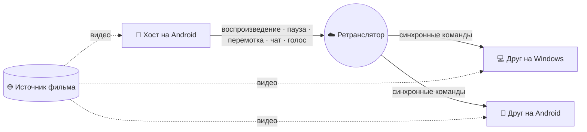

<div align="center">


<br><br>

### Язык · Read in your language

<p>
  <a href="../README.md"></a>
  <a href="README.zh-CN.md"></a>
  <a href="README.fa.md"></a>
  <a href="README.ru.md"></a>
</p>

<p>
  <a href="https://github.com/Pytholearn/UsPlayer-Android/releases/latest"></a>
  <a href="https://github.com/Pytholearn/UsPlayer/releases/latest"></a>
</p>

</div>

---

## Русский

**Us Player для Android** — совместный просмотр в вашем кармане. Создайте комнату, отправьте друзьям приглашение — и все смотрят синхронно, с телефона или [с компьютера](https://github.com/Pytholearn/UsPlayer), без IP-адресов, проброса портов и настройки роутера. Кто-то поставил на паузу — пауза у всей комнаты. Находите фильм прямо в приложении, общайтесь голосом, переписывайтесь поверх видео, отправляйте ❤️ и не отрывайтесь от фильма.

> **Android + Windows:** один аккаунт и одни и те же комнаты на обеих платформах. Это нативное Android-приложение (Kotlin, Jetpack Compose, Media3), которое говорит на протоколе [плеера для Windows](https://github.com/Pytholearn/UsPlayer) байт в байт; совместимость проверяется на настоящем коде Windows при каждой сборке.

**На этой странице:** [Возможности](#features) · [Установка](#install) · [Смотреть вместе](#watch-together) · [Как это работает](#how-it-works) · [Разрешения](#permissions) · [Приватность](#privacy) · [Вопросы](#faq) · [Лицензия](#license)

<a id="features"></a>

### ✨ Возможности

<table>
<tr>
<td width="50%" valign="top">

#### 🎬 Совместный просмотр
- Комната создаётся одним касанием, вход **по приглашению** — никаких настроек
- **Общее управление**: воспроизведение, пауза, перемотка и скорость синхронны у всех
- Расхождение **около ±100 мс** — выравнивание часов, плавная подстройка скорости, перемотка только при необходимости
- Необязательный **пароль** комнаты, который никогда не передаётся открытым текстом
- **Администратор комнаты**: хост выбирает фильм или разрешает это другу, может выгнать, заблокировать или заглушить участника для всех
- **Комната переживает хоста**: если администратор ушёл или потерял связь, комната переходит к следующему вошедшему — продолжить её может и телефон
- Субтитры, открытые хостом, **отправляются всей комнате**, включая опоздавших

</td>
<td width="50%" valign="top">

#### 🎙️ Оставайтесь на связи
- **Голосовой чат** — микрофон включается при входе в голос, выключается одним касанием; эхо- и шумоподавление выполняет сам телефон
- Голос через **динамик** или **разговорный динамик** — на ваш выбор
- **Заглушить для себя** любого участника
- **Чат поверх видео**: сообщения плавно появляются внизу кадра
- **Реакции на весь экран** 👍 ❤️ 😂 😮 🔥 👏
- Кто в комнате, какой у кого пинг и кто говорит
- Комната без фильма, чата и голоса в течение 10 минут закрывается сама

</td>
</tr>
<tr>
<td valign="top">

#### 🔎 Найти фильм
- **Поиск по названию** — фильмы и сериалы с постером, рейтингом, сезонами и комментариями; нажмите **Play**, ничего не нужно скачивать
- Вставьте **ссылку на страницу фильма** — Us Player сам найдёт настоящий `.mp4` / `.mkv` / `.m3u8` и покажет каждый шаг
- Выбирает основной фильм в лучшем качестве, пропуская трейлеры и лишнее
- Ссылки, которыми поделились из любого приложения, сразу открываются в Us Player
- Продолжение с места остановки, история, плейлист и избранное

</td>
<td valign="top">

#### 📱 Создан для телефона
- **Масштаб двумя пальцами** от 0,5× до 4× и перемещение по кадру
- **Картинка в картинке** — смотрите поверх других приложений
- Двойное касание для перемотки, свайп для поиска
- Фильм и комната продолжают работать в фоне со своим уведомлением
- Вертикальная и горизонтальная ориентация, планшеты; субтитры остаются в кадре при повороте телефона

</td>
</tr>
<tr>
<td valign="top">

#### 🔊 Звук, видео и субтитры
- Громкость до **300%** с компрессором и задержкой звука
- **10-полосный эквалайзер** с пресетами и нормализацией
- Яркость, контраст, насыщенность, гамма, оттенок, резкость, поворот, зеркало — вживую
- Субтитры `.srt` / `.ass` / `.vtt`; размер, цвет, обводка, положение и задержка меняются вживую; **кодировка** персидских файлов определяется автоматически

</td>
<td valign="top">

#### 💙 Сделано с заботой
- **Один аккаунт** — входите тем же аккаунтом, что и в Windows; новый подтверждается 6-значным кодом из письма, и комнаты узнают вас с любого устройства
- Интерфейс на **английском и персидском**, с правильной вёрсткой справа налево
- Три темы — **Us Blue**, тёмно-фиолетовая и тёмно-мятная
- **Обновления внутри приложения** с проверкой **SHA-256**; установка — только после запроса Android
- Все версии подписаны **одним ключом**. **Никакого отслеживания.**

</td>
</tr>
</table>

<a id="install"></a>

### 📥 Установка

1. Скачайте **`UsPlayer-<версия>.apk`** из [последнего релиза](https://github.com/Pytholearn/UsPlayer-Android/releases/latest).
2. Откройте файл. Android попросит разрешить установку из этого источника — обычный запрос для приложений не из магазина. Разрешите и установите.
3. Если **Play Protect** сообщит, что приложение установлено не из Google Play, нажмите **Install anyway**. У каждого релиза указан **SHA-256**, а отпечаток ключа подписи приведён [ниже](#privacy).
4. При первом запуске **войдите** — или создайте аккаунт и подтвердите почту 6-значным кодом. Этот же аккаунт работает и в Windows.

**Требуется Android 8.0 или новее.** Уже установлено? Приложение обновляется само — просто примите обновление, когда оно спросит.

<a id="watch-together"></a>

### 🍿 Совместный просмотр в три шага

| Шаг | Хост | Друзья — на телефоне или ПК |
|:-:|---|---|
| **1** | Откройте **Party → Host**, при желании задайте имя комнаты и пароль, нажмите **Create Room** | Откройте **Party → Join** |
| **2** | Нажмите **Copy invite** и отправьте приглашение | Вставьте приглашение и войдите |
| **3** | Выберите фильм через **Search**, по ссылке или через «Поделиться» из другого приложения | Тот же фильм синхронно открывается у всех |

<a id="how-it-works"></a>

### 🧠 Как это работает

Ваш фильм **никогда не проходит через наши серверы**. Каждый смотрит видео **напрямую из источника**. Через ретранслятор идут только небольшие управляющие сообщения — воспроизведение, пауза, перемотка, чат — и голос.



<a id="permissions"></a>

### 🔐 Разрешения и зачем они нужны

| Разрешение | Для чего |
|---|---|
| 🎙️ Микрофон | Голосовой чат. Запрашивается только при входе в голос; всё остальное работает без него. |
| 🔔 Уведомления | Уведомления воспроизведения и комнаты — благодаря им Android не останавливает фильм и комнату в фоне. |
| 📦 Установка приложений | Обновления внутри приложения. Ничего не устанавливается само: вы нажимаете, файл проверяется, и Android спрашивает ещё раз. |

<a id="privacy"></a>

### 🔒 Приватность и безопасность

- **Пароли комнат остаются на вашем телефоне.** Вход использует challenge–response с солью; по сети передаётся только доказательство.
- **Пароль аккаунта уходит только на наш сервер**, по TLS с закреплённым (pinned) сертификатом — он проверяется до отправки первого байта. Сессия хранится на телефоне и никогда не попадает в резервные копии.
- **Секреты комнаты остаются у администратора.** Друзья получают только то, что нужно, чтобы продолжить комнату, если администратор уйдёт.
- **Сообщениям по умолчанию не доверяют.** Трафик комнаты ограничен по размеру, проверяется, защищён от повторов и ограничен по частоте.
- **Локальные файлы не передаются.** Файла с вашего телефона нет на устройстве друга, поэтому комната ставится на паузу и просит **ссылку, доступную всем**.
- **Проверенные обновления.** Загрузки, не совпадающие с опубликованным **SHA-256**, отклоняются.
- **Никакого отслеживания.** Мы не собираем, что вы смотрите. Единственное, что сообщает приложение, — анонимный счётчик показа рекламы.
- **Все релизы подписаны одним ключом.** Отпечаток SHA-256 сертификата:

```
12:CE:4D:C4:82:92:0C:74:C0:B7:24:74:E7:22:16:9E:DD:CB:B2:80:84:23:E7:1B:13:55:0B:CC:81:A2:5B:1D
```

<a id="faq"></a>

### ❓ Частые вопросы

<details>
<summary><b>Нужна ли друзьям общая Wi‑Fi сеть или открытый порт?</b></summary>
<br>
Нет. Хост получает приглашение от ретранслятора, и любой может войти откуда угодно только по нему.
</details>

<details>
<summary><b>Можно ли войти в комнату, созданную на Windows?</b></summary>
<br>
Да — и с Windows можно войти в вашу, с чатом, реакциями и голосом. Оба приложения используют один протокол, и это проверяется на настоящем коде <a href="https://github.com/Pytholearn/UsPlayer">Windows</a> при каждой сборке Android.
</details>

<details>
<summary><b>Зачем нужен аккаунт?</b></summary>
<br>
Чтобы комната знала, кто вы, а не только с какого телефона вы зашли: права, выданные администратором, — или блокировка — следуют за вами на любое устройство. Используйте один аккаунт на телефоне и ПК. Забыли пароль? <b>Forgot password?</b> на экране входа пришлёт код на почту.
</details>

<details>
<summary><b>Что будет, если хост уйдёт или потеряет интернет?</b></summary>
<br>
Комната продолжится. Она перейдёт к следующему вошедшему, который станет новым администратором — на телефоне или ПК. Если прежний хост вернётся, он войдёт как участник.
</details>

<details>
<summary><b>С включённым VPN не работают вход, поиск или комната.</b></summary>
<br>
Наш сервер находится в Иране, и некоторые VPN не могут до него достучаться. Исключите Us Player в приложении VPN (раздельное туннелирование / режим по приложениям) или выключите VPN. Некоторые иранские киносайты также блокируют зарубежные IP, поэтому фильм с них может воспроизводиться только без VPN.
</details>

<details>
<summary><b>Почему приложения нет в Google Play?</b></summary>
<br>
Us Player обновляется из этого репозитория, а Play такого не разрешает. APK на странице релизов — официальная сборка, подписанная ключом выше.
</details>

<details>
<summary><b>Друзья слышат эхо своего голоса.</b></summary>
<br>
Ваш микрофон слышит динамик. Наденьте наушники, выключайте микрофон, когда молчите, или отключите <b>Settings → Voice → Play voice through the loudspeaker</b> — эхоподавление телефона лучше всего работает через разговорный динамик.
</details>

<details>
<summary><b>Комната отключается, когда я переключаюсь в другое приложение.</b></summary>
<br>
Режим энергосбережения на некоторых телефонах останавливает приложения в фоне. Разрешите Us Player <b>неограниченное</b> использование батареи в настройках Android и оставьте его уведомления включёнными — по ним Android понимает, что приложение занято.
</details>

<details>
<summary><b>Персидские субтитры показывают <code>???</code> или кракозябры.</b></summary>
<br>
Кодировка определяется автоматически, для персидских файлов пробуется Windows-1256. Если файл всё равно выглядит неправильно, выберите <b>Windows-1256</b> в <b>Subtitles → Text encoding</b>.
</details>

<details>
<summary><b>Сайт сообщает, что фильм нельзя воспроизвести.</b></summary>
<br>
Сервисы с DRM (Filimo, Namava, Gapfilm и подобные) воспроизводятся только в своих официальных приложениях; Us Player прямо скажет об этом, а не будет молча сбоить.
</details>

<a id="license"></a>

### 📄 Лицензия

Проект распространяется по **[лицензии MIT](../LICENSE)**. © 2026 Pytholearn — свободное использование, изменение и распространение; в копиях необходимо сохранять уведомление об авторских правах и текст лицензии.

---

<div align="center">

[English](../README.md) · [中文](README.zh-CN.md) · [فارسی](README.fa.md) · [Русский](README.ru.md) · [MIT License](../LICENSE)

[Android](https://github.com/Pytholearn/UsPlayer-Android) · [Windows](https://github.com/Pytholearn/UsPlayer)

<br>

<sub>Нравится Us Player? ⭐ на GitHub помогает другим киноманам его найти.</sub>

</div>
