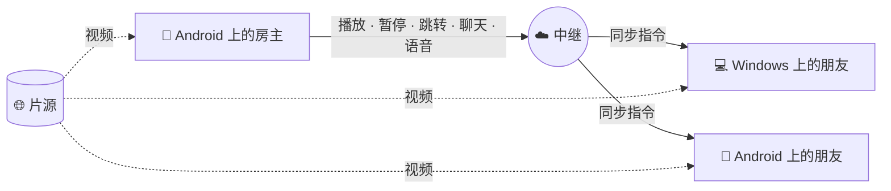

<div align="center">



<br><br>

### 语言 · Read in your language

<p>
  <a href="../README.md"></a>
  <a href="README.zh-CN.md"></a>
  <a href="README.fa.md"></a>
  <a href="README.ru.md"></a>
</p>

<p>
  <a href="https://github.com/Pytholearn/UsPlayer-Android/releases/latest"></a>
  <a href="https://github.com/Pytholearn/UsPlayer/releases/latest"></a>
</p>

</div>

---

## 中文

**Us Player Android 版**把一起看片装进你的口袋。创建房间，把邀请发给朋友，所有人同步观看——无论在手机上还是[在电脑上](https://github.com/Pytholearn/UsPlayer)，都不需要 IP 地址、端口转发或修改路由器。有人暂停，整个房间一起暂停。在应用内直接找片，边看边语音、在画面上聊天、发送 ❤️ 互动，目光不必离开电影。

> **Android + Windows：** 两端使用同一个账号、进入同一个房间。这是一个原生 Android 应用（Kotlin、Jetpack Compose、Media3），与 [Windows 播放器](https://github.com/Pytholearn/UsPlayer)的同步协议逐字节一致，每次构建都会对照真实的 Windows 代码进行测试。

**本页内容：** [功能](#features) · [安装](#install) · [一起观看](#watch-together) · [工作原理](#how-it-works) · [权限](#permissions) · [隐私](#privacy) · [常见问题](#faq) · [许可证](#license)

<a id="features"></a>

### ✨ 功能

<table>
<tr>
<td width="50%" valign="top">

#### 🎬 一起看片
- 一键创建房间，**凭邀请加入**——无需任何设置
- **共享控制**：任何人的播放、暂停、跳转和变速都会同步给所有人
- 误差约 **±100 毫秒**——时钟对齐、平滑调速，只在必要时跳转
- 可选的房间**密码**，从不以明文在网络上传输
- **房间管理员**：房主选片或允许朋友选片，可以踢出、封禁或为所有人静音某人
- **房主离开房间也不会结束**：管理员离开或断网时，房间交给下一位加入者——手机也可以接手
- 房主打开的字幕会**发送给整个房间**，包括后来加入的人

</td>
<td width="50%" valign="top">

#### 🎙️ 保持连线
- **语音聊天**——加入语音即开麦，一点即静音；回声消除和降噪由手机本身完成
- 语音可通过**扬声器**或**听筒**播放，随你选择
- **仅对我静音**任意成员
- **画面内聊天**：消息在视频底部淡入
- **飘屏表情** 👍 ❤️ 😂 😮 🔥 👏
- 谁在房间里、延迟多少、谁在说话
- 10 分钟内没有电影、聊天和语音的房间会自动关闭

</td>
</tr>
<tr>
<td valign="top">

#### 🔎 找片
- **按片名搜索**——电影和剧集，附海报、评分、分季和评论；点 **播放** 即可，无需下载
- 粘贴**电影页面链接**——Us Player 会自己找到真正的 `.mp4` / `.mkv` / `.m3u8`，并显示每一步
- 自动选择正片的最高画质，跳过预告片和杂项
- 从任何其他应用分享的链接都会直接在 Us Player 中打开
- 断点续播、历史记录、播放列表和收藏

</td>
<td valign="top">

#### 📱 为手机打造
- **双指缩放**画面 0.5× 到 4×，并可拖动
- **画中画**——在其他应用上方继续观看
- 双击快进快退，滑动拖动进度
- 电影和房间带着通知在后台保持运行
- 适配竖屏、横屏和平板；旋转手机时字幕仍留在画面上

</td>
</tr>
<tr>
<td valign="top">

#### 🔊 音频、视频与字幕
- 音量最高 **300%**，可选压缩器和音频延迟
- **10 段均衡器**，含预设和响度均衡
- 亮度、对比度、饱和度、伽马、色调、锐化、旋转、镜像——实时调整
- 字幕支持 `.srt` / `.ass` / `.vtt`；大小、颜色、描边、位置和延迟实时生效；自动识别波斯语**编码**

</td>
<td valign="top">

#### 💙 用心打造
- **一个账号**——使用与 Windows 相同的账号登录；新账号通过 6 位邮箱验证码确认，无论从哪台设备加入，房间都能认出你
- 界面支持**英语和波斯语**，从右到左排版正确
- 三套主题——**Us Blue**、深紫、深薄荷
- **应用内更新**，下载前校验 SHA-256，安装前由 Android 再次确认
- 所有版本都使用**同一把密钥**签名。**不做任何追踪。**

</td>
</tr>
</table>

<a id="install"></a>

### 📥 安装

1. 从[最新版本](https://github.com/Pytholearn/UsPlayer-Android/releases/latest)下载 **`UsPlayer-<版本>.apk`**。
2. 打开它。Android 会请求允许从此来源安装应用——对于非应用商店的应用这是正常提示。允许后安装。
3. 如果 **Play Protect** 提示该应用并非来自 Google Play，请点 **Install anyway**。每个版本都列出了 **SHA-256**，签名密钥的指纹见[下文](#privacy)。
4. 首次启动时**登录**——或创建账号并用 6 位验证码确认邮箱。同一个账号也可在 Windows 上使用。

**需要 Android 8.0 或更高版本。** 已经安装？应用会自行更新，提示时接受即可。

<a id="watch-together"></a>

### 🍿 三步开始一起看

| 步骤 | 房主 | 朋友——用手机或电脑 |
|:-:|---|---|
| **1** | 打开 **Party → Host**，可填写房间名和密码，点 **Create Room** | 打开 **Party → Join** |
| **2** | 点 **Copy invite** 并发送邀请 | 粘贴邀请并加入 |
| **3** | 用 **Search**、链接或从其他应用分享来选片 | 同一部电影为所有人同步打开 |

<a id="how-it-works"></a>

### 🧠 工作原理

你的电影**从不经过我们的服务器**。每个人都**直接从片源**播放视频。只有很小的控制消息——播放、暂停、跳转、聊天——以及语音会经过中继。



<a id="permissions"></a>

### 🔐 权限及用途

| 权限 | 用途 |
|---|---|
| 🎙️ 麦克风 | 语音聊天。仅在加入语音时请求；其余功能无需此权限。 |
| 🔔 通知 | 播放和房间通知——Android 借此让电影和房间在后台保持运行。 |
| 📦 安装应用 | 应用内更新。不会自动安装：由你点击，文件经过校验，Android 还会再次询问。 |

<a id="privacy"></a>

### 🔒 隐私与安全

- **房间密码留在你的手机上。** 加入时使用加盐的挑战–应答，网络上只传输一个证明。
- **账号密码只发送到我们的服务器**，通过 TLS 并校验固定（pinned）证书——在发送任何一个字节之前就会检查。登录会话保存在你的手机上，且从不备份。
- **房间的秘密留在管理员手中。** 朋友只获得在管理员离开时接手房间所需的信息。
- **默认不信任的消息处理。** 房间流量有大小限制、经过校验、防重放并限速。
- **不共享本地文件。** 你手机上的文件在朋友的设备上并不存在，因此房间会暂停，并请你提供**所有人都能打开的链接**。
- **更新经过校验。** 与公布的 **SHA-256** 不符的下载会被拒绝。
- **不做追踪。** 我们不收集你看了什么。应用唯一上报的，是广告展示时的一次匿名计数。
- **所有版本都使用同一把密钥签名。** 证书的 SHA-256 指纹：

```
12:CE:4D:C4:82:92:0C:74:C0:B7:24:74:E7:22:16:9E:DD:CB:B2:80:84:23:E7:1B:13:55:0B:CC:81:A2:5B:1D
```

<a id="faq"></a>

### ❓ 常见问题

<details>
<summary><b>朋友需要连同一个 Wi‑Fi 或开放端口吗？</b></summary>
<br>
不需要。房主从中继获得邀请，任何人在任何地方凭这个邀请即可加入。
</details>

<details>
<summary><b>我能加入别人在 Windows 上创建的房间吗？</b></summary>
<br>
可以——对方也能加入你的房间，聊天、表情和语音都可用。两个应用使用同一协议，每次 Android 构建都会对照真实的 <a href="https://github.com/Pytholearn/UsPlayer">Windows</a> 代码进行检查。
</details>

<details>
<summary><b>为什么需要账号？</b></summary>
<br>
这样房间知道你是谁，而不只是你用的是哪部手机：管理员给你的权限——或封禁——会随你到任何设备。在手机和电脑上使用同一个账号即可。忘记密码？登录界面上的 <b>Forgot password?</b> 会向你的邮箱发送验证码。
</details>

<details>
<summary><b>房主离开或断网会怎样？</b></summary>
<br>
房间会继续。它会交给下一位加入的人，由其成为新的管理员——手机或电脑都可以。原房主回来后以成员身份重新加入。
</details>

<details>
<summary><b>开着 VPN 时无法登录、搜索或连接房间。</b></summary>
<br>
我们的服务器位于伊朗，有些 VPN 无法访问它。请在 VPN 应用中将 Us Player 排除（分应用代理 / 分流），或关闭 VPN。部分伊朗影视网站也会屏蔽境外 IP，因此来自这些网站的电影可能只能在关闭 VPN 时播放。
</details>

<details>
<summary><b>为什么不在 Google Play 上架？</b></summary>
<br>
Us Player 从本仓库自行更新，而 Play 不允许这样做。发布页上的 APK 就是官方版本，使用上面的密钥签名。
</details>

<details>
<summary><b>朋友听到了自己声音的回声。</b></summary>
<br>
你的麦克风收到了扬声器的声音。戴上耳机、不说话时静音，或关闭 <b>Settings → Voice → Play voice through the loudspeaker</b>——手机的回声消除在听筒模式下效果最好。
</details>

<details>
<summary><b>切换到其他应用时房间断开了。</b></summary>
<br>
有些手机的省电功能会在后台停止应用。请在 Android 设置中把 Us Player 的电池使用设为<b>不受限制</b>，并允许它的通知——Android 正是借此知道应用正在工作。
</details>

<details>
<summary><b>波斯语字幕显示为 <code>???</code> 或乱码。</b></summary>
<br>
编码会自动识别，波斯语文件会尝试 Windows-1256。如果仍显示不正确，请在 <b>Subtitles → Text encoding</b> 中选择 <b>Windows-1256</b>。
</details>

<details>
<summary><b>某个网站提示电影无法播放。</b></summary>
<br>
受 DRM 保护的服务（Filimo、Namava、Gapfilm 等）只能在其官方应用内播放；Us Player 会明确告诉你，而不是默默失败。
</details>

<a id="license"></a>

### 📄 许可证

本项目以 **[MIT 许可证](../LICENSE)** 开源。© 2026 Pytholearn——可自由使用、修改和分发；副本中须保留版权声明和许可证全文。

---

<div align="center">

[English](../README.md) · [中文](README.zh-CN.md) · [فارسی](README.fa.md) · [Русский](README.ru.md) · [MIT License](../LICENSE)

[Android](https://github.com/Pytholearn/UsPlayer-Android) · [Windows](https://github.com/Pytholearn/UsPlayer)

<br>

<sub>喜欢 Us Player？在 GitHub 上点个 ⭐，能帮助更多影迷发现它。</sub>

</div>
